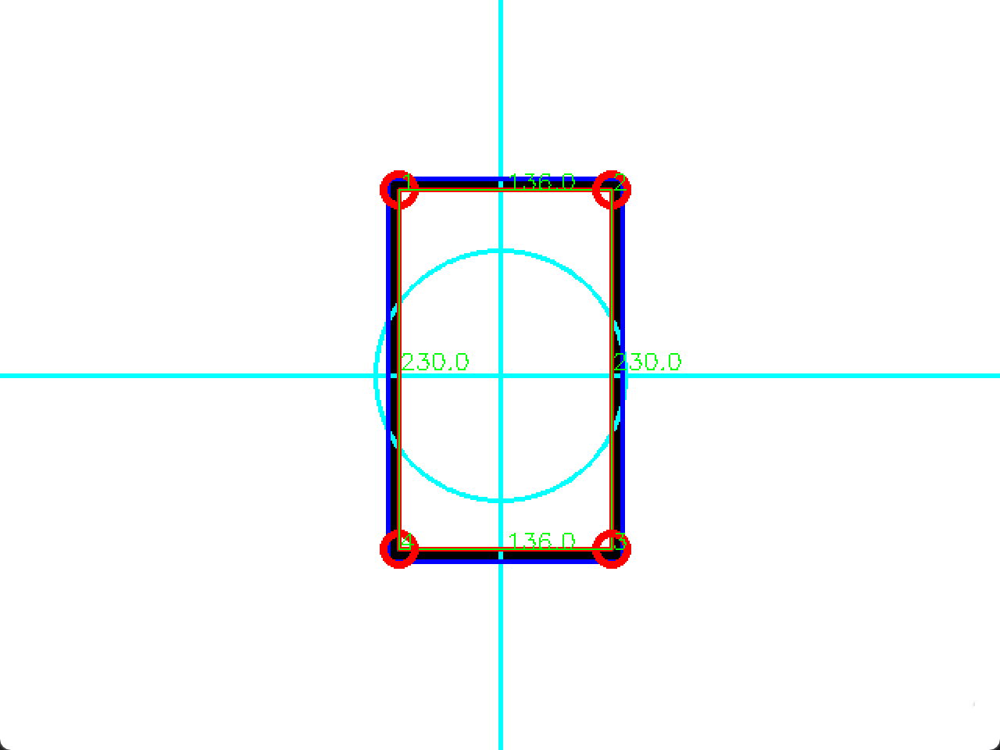
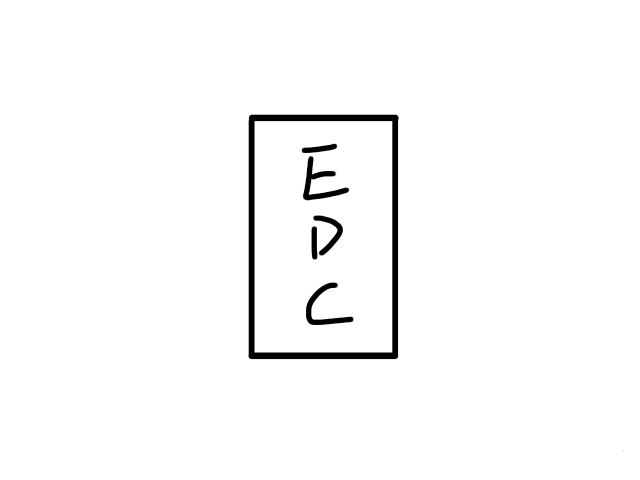
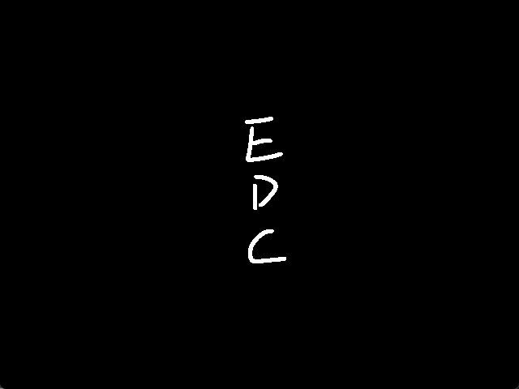
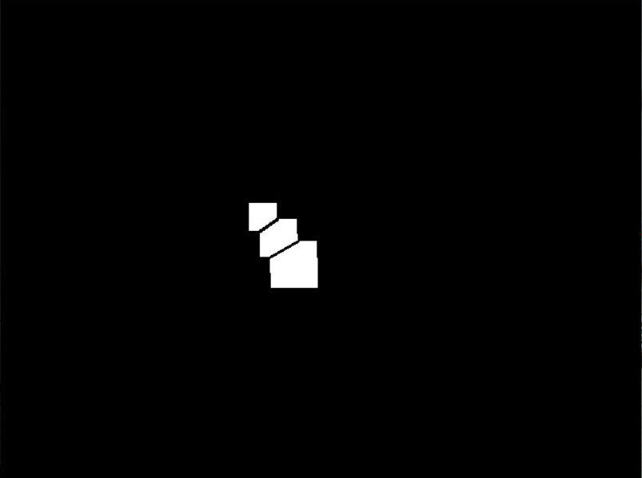

# 25年电赛C题

## 方案
由于赛题给定了目标物的特征，<b>A4版面和四周2cm黑色边框</b>，因此可以获得目标物的真实物理尺寸，通过CV进而可以获得目标物的<b>距离与欧拉角</b>，以此完成该题目的核心要求
### 目标板识别
<b>1.</b> 使用OpenCV将图像进行预处理，加入<b>图形学闭运算</b>（先膨胀后腐蚀去除图像中的5mm轴线影响），对闭运算后的灰度图像进行<b>Canny算子边缘提取</b>

<b>2.</b> 使用OpenCV对边缘图像进行轮廓提取，对轮廓先后进行<b>面积筛选</b>（筛选出轮廓面积在SQUARE_MIN-SQUARE_MAX之间的轮廓）、<b>轮廓中心坐标筛选</b>（筛选出轮廓中心在以图像中心为圆心、CIRCLE_ROI_RADIUS为半径的圆ROI内的轮廓）、<b>轮廓面积非极大值抑制</b>

<b>3.</b> 对通过上述步骤进行筛选出来的轮廓进行<b>多边形逼近</b>，提取出矩形外框的四个角点,如下图：

### 目标物中心距离与欧拉角解算以及图像矫正
<b>1.</b> 使用OpenCV提供的solvePNP算法，对目标物进行距离与欧拉角的解算

<b>2.</b> 使用PNP算法得到的平移向量和自己构造的<b>无旋转向量</b>，使用projectPoints函数将目标物3D点坐标映射到2D图像上，<b>得到目标物四个角点目标点位置</b>

<b>3.</b> 使用getPerspectiveTransform函数，传入当前边框四个点的像素坐标和上一步得到的目标坐标，计算出<b>透视变换矩阵</b>，使用warpPerspective函数得到<b>透视变换后的矫正图像</b>

<b>4. </b> 重复<b>目标板识别</b>步骤，将使用的图像更换为刚刚得到的矫正图像

### 内部基础图形识别及边长计算
<b>1.</b> 以上一步使用的轮廓为ROI，创建掩膜Mask，提取内部图形图像，为了防止调试时瞎眼，对内部图像进行反转操作，如下图：

| 原图像 | 内部图像 |
| :-: | :-: |
|  |  |

<b>1.</b> 对内部图像进行轮廓提取，同时筛选出内部轮廓面积大于阈值INNER_SHAPE_SQUARE_MIN的轮廓，分别对这些轮廓进行<b>多边形近似、计算轮廓面积、找最小外接矩形和找最小外接圆</b>，有以下几种情况：

| 情况 | 图形形状 | 重叠情况 |
| :-: | :-: | :-: |
| 1.多边形角点数=3 2.轮廓面积/最小外接圆面积<阈值 | 三角形 | 不重叠 |
| 1.多边形角点数=3 2.轮廓面积/最小外接圆面积>阈值 | 圆形 | 不重叠 |
| 1.多边形角点数=4 2.轮廓面积/最小外接矩形面积<阈值1  3.轮廓面积/最小外接圆形面积<阈值2 | 无 | 重叠 |
| 1.多边形角点数=4 2.轮廓面积/最小外接矩形面积>阈值1 3.轮廓面积/最小外接圆形面积<阈值2 | 正方形 | 不重叠 |
| 1.多边形角点数=4 2.轮廓面积/最小外接圆形面积>阈值2 | 圆形 | 不重叠 |
| 1.多边形角点数>4 2.轮廓面积/最小外接圆形面积<阈值 | 无 | 重叠 |
| 1.多边形角点数>4 2.轮廓面积/最小外接圆形面积>阈值 | 圆形 | 不重叠 |

<b>2.</b>若为基础图形：<b>真实边长(mm) = 边框真实周长(mm)*(内部图形轮廓周长(像素) 或 直径(像素))/边框轮廓边长(像素)</b>

### 重叠正方形分割
<b>1.</b> 对判定为重叠的轮廓进行精度更高的多边形近似，对多边形的角点进行分类，以角点为圆心，做圆形掩膜与上内部图形图像，计算黑色像素数量和总像素数量，计算黑色像素数量/总像素数量比值，若比值小于阈值POINT_SORT_LIMIT，则判定为<b>正方形边框角点</b>，反之则为<b>正方形相交的交点</b>

<b>2.</b> 连接两个矩形相交处的两个交点，使重叠N个正方形轮廓可以分解为N个离散轮廓,如下图：

<b>3.</b> 遍历所有离散轮廓，以单个离散轮廓构造掩膜，对各个轮廓做<b>精细的多边形近似</b>，<b>按1中方法对角点进行分类</b>

<b>4.</b> 对于离散轮廓，有以下几种情况：

| 情况 | 边长计算方法 |
| :-: | :-: |
| 边框角点数=3 | 计算边框角点间的距离，最长的为对角线，边长=非对角线的两点距离 |
| 边框角点数=2 （这两个角点为中间无交点） | 这两个边框角点为非对角线点，边长=这两点距离 |
| 边框角点数=2 （这两个角点为中间有交点） | 这两个边框角点为对角线点，边长=这两点距离/sqrt(2) |

## 目前需改进方向
<b>1.</b> 需要重构

<b>2.</b> 优化完善重叠正方形分割2的实现，理论没有问题，只是代码实现只实现了一半，导致泛用性不佳

<b>3.</b> 将图像二值化修改为HSV颜色空间二值化，降低光线影响

# [🐧要做一辈子嵌入式开发!!!!!🐧](https://github.com/Geek-Egret)

